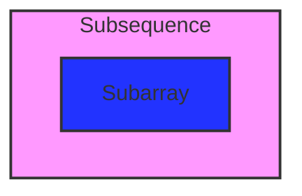

- Subarray
  - There are n*(n+1)/2 subarrays in an array of size n.
  - Subarrays are the continuous part of array.
- Subsequence
  - There are 2^n subsequences in an array of size n.
  - Subsequence are not the continuous part of the array but maintains the order of the element.
    
 **Note**:  Every subarray is a subsequence but every subsequence is not a subarray.

